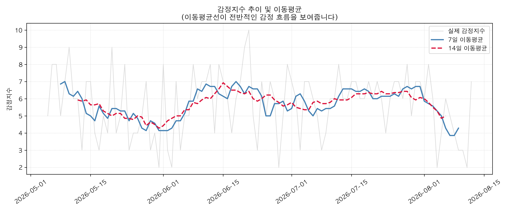
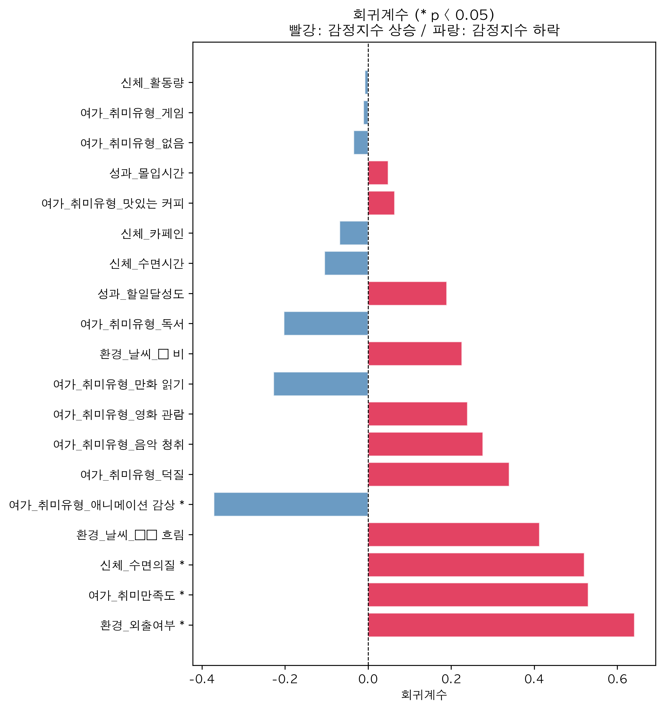
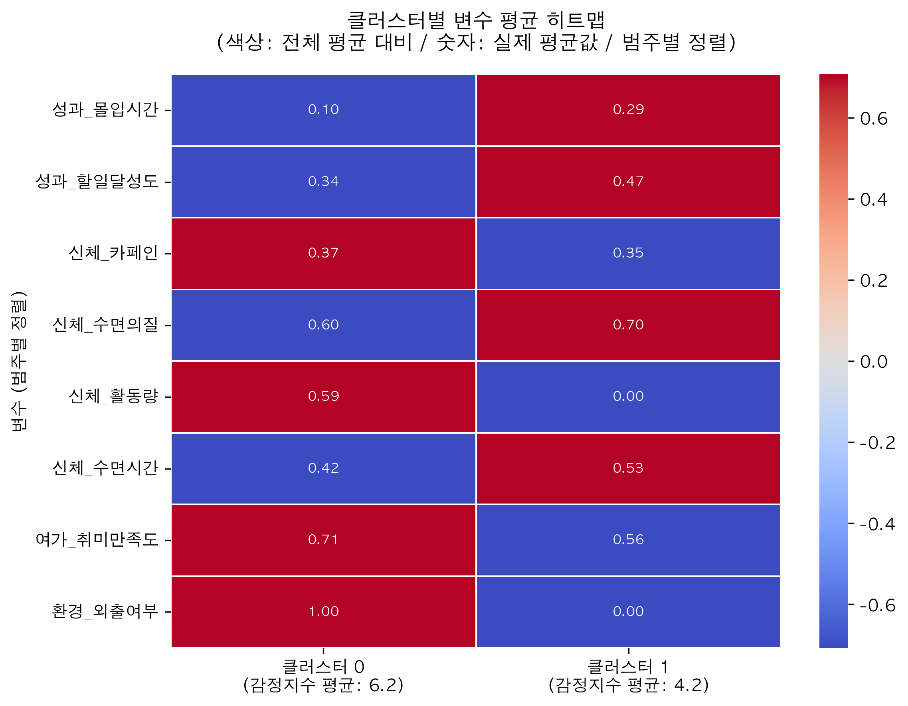
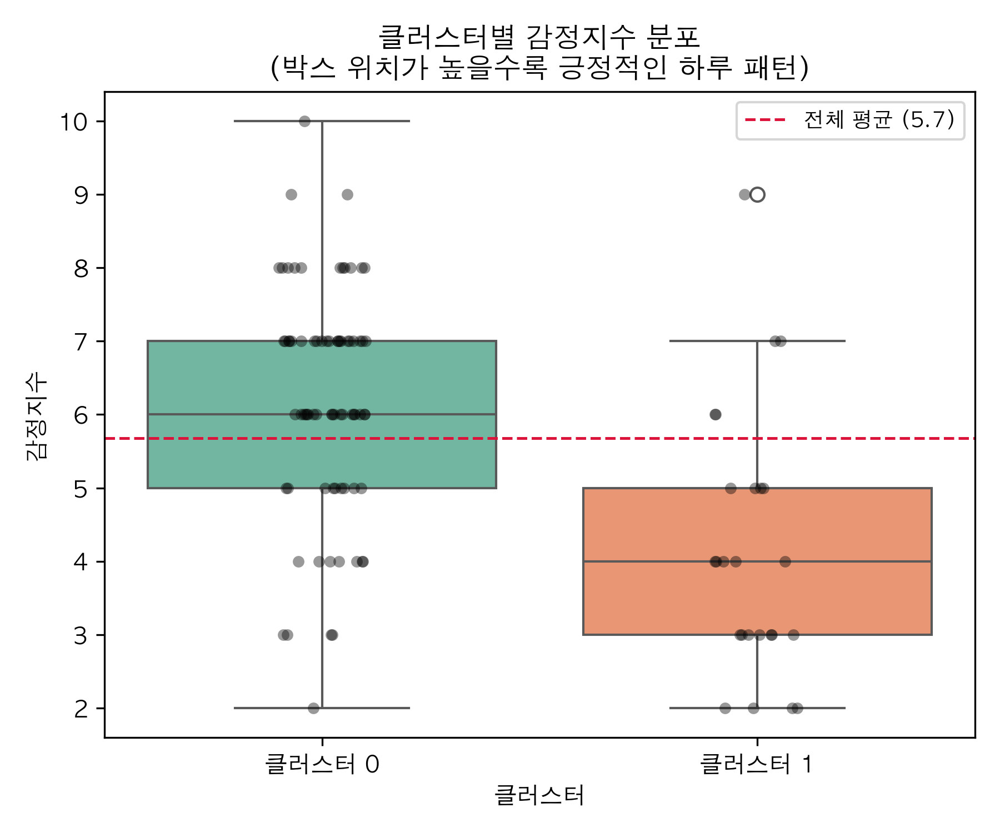
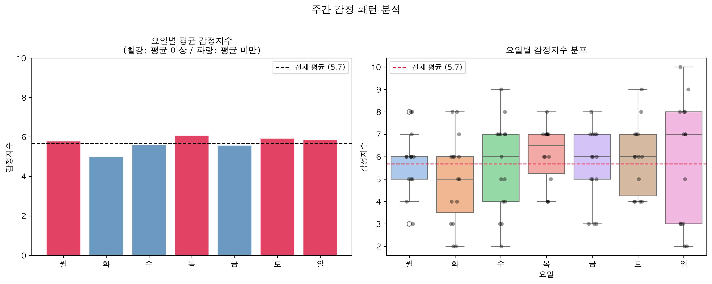
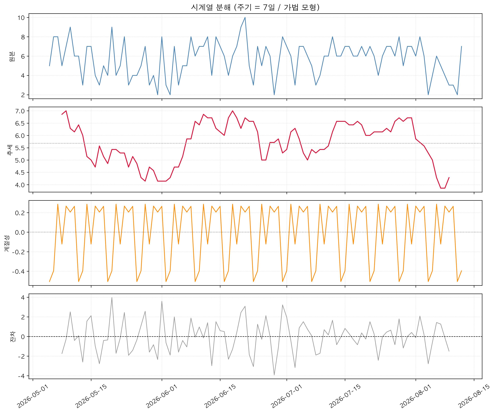
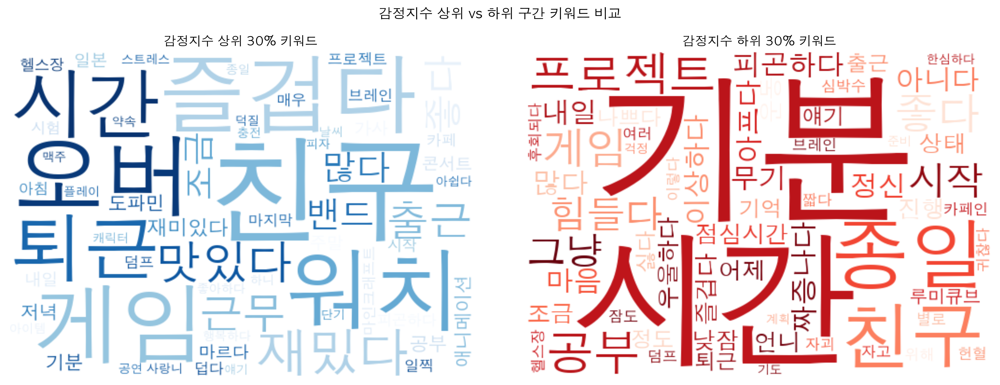
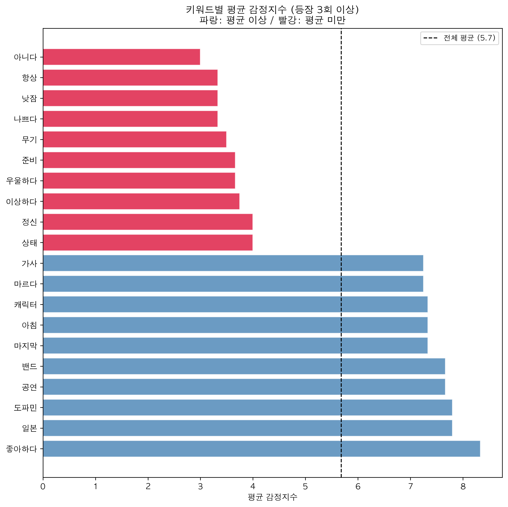
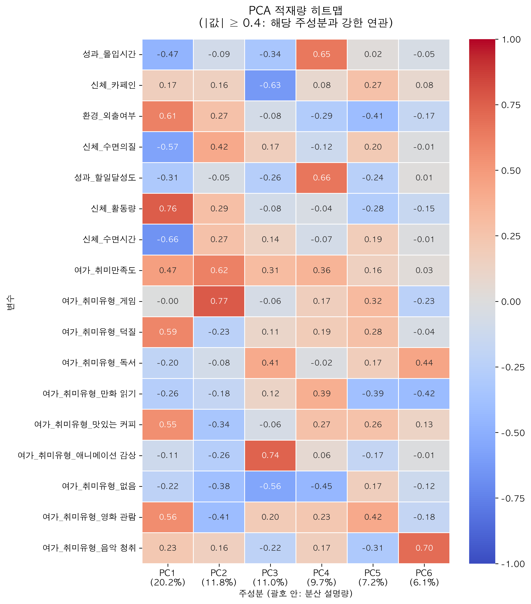
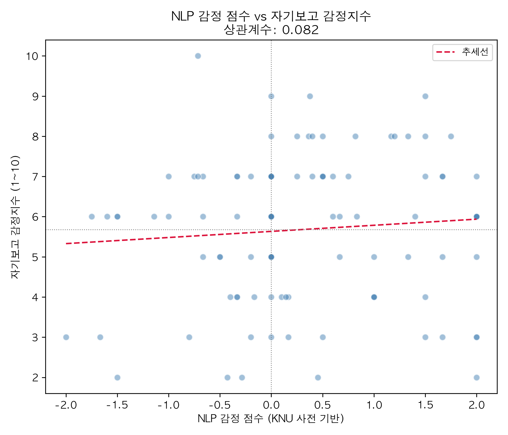

# 분석 결과 요약 (Key Findings)

> 본 분석은 2026-05-05 ~ 2026-08-12 (100일) 기간의 개인 기록 데이터를 기반으로 합니다.
> 표본 크기 및 개인 특성에 따라 결과의 일반화에 한계가 있으며, 통계적 경향성으로 해석합니다.

---

## 1. 감정지수 전반적 현황

- **분석 기간 평균 감정지수**: 5.68 / 10
- **표준편차**: 1.85 (일별 감정 기복이 있으나 전반적으로 안정적)
- **ADF 정상성 검정 p-value**: 0.0000 → 장기 추세 없이 일정 수준 유지

---

## 2. 감정지수에 영향을 미치는 주요 변수 (회귀분석)

OLS 회귀분석 결과 (R² = 0.577, F-통계량 p < 0.001)

| 변수 | 회귀계수 | 방향 | 유의성 |
|------|---------|------|--------|
| 환경_외출여부 | +0.64 | 외출한 날 감정지수 상승 | p < 0.01 |
| 여가_취미만족도 | +0.53 | 취미 만족도 높을수록 상승 | p < 0.05 |
| 신체_수면의질 | +0.52 | 수면의 질 좋을수록 상승 | p < 0.01 |
| 여가_취미유형_애니메이션 감상 | -0.37 | 애니메이션 감상한 날 하락 | p < 0.05 |

---

## 3. 하루 패턴 유형화 (클러스터링)

K-Means 클러스터링 결과 k=2로 두 가지 하루 패턴이 뚜렷하게 분리됨.

| 클러스터 | 일수 | 감정지수 평균 | 주요 특징 |
|---------|------|-------------|---------|
| 클러스터 0 | 75일 | 6.2 | 외출, 신체 활동, 취미 만족도 높음 |
| 클러스터 1 | 25일 | 4.2 | 외출 없음, 신체 활동 없음 |

외출 여부가 두 클러스터를 가르는 핵심 변수로, 집에 머문 날 감정지수가 평균 2점 낮음.

---

## 4. 주간 감정 패턴 (시계열 분석)

- 시계열 분해에서 **7일 주기 계절성**이 100일 내내 뚜렷하게 반복됨
- **화요일 감정지수 최저** (평균 약 5.0), 목·일요일이 상대적으로 높음
- 월요병보다는 "화요일 슬럼프" 패턴

---

## 5. 감정과 연관된 키워드 (텍스트 마이닝)

전체 1,127개 토큰 추출 (100일 브레인 덤프 기반)

**감정 높은 날 주요 키워드**: 친구, 워치, 즐겁다, 게임, 재밌다, 도파민, 밴드, 맛있다
**감정 낮은 날 주요 키워드**: 기분, 종일, 짜증나다, 우울하다, 무기, 정신, 이상하다

→ 친구와 함께하거나 좋아하는 활동(덕질, 공연, 게임)을 한 날 감정지수가 높은 경향

---

## 6. 요인분석 (PCA)

Kaiser 기준 6개 주성분 추출 (누적 분산 설명량 66%)

- **PC1 (20.2%)**: 활동성 요인 — 신체_활동량, 환경_외출여부, 덕질, 영화 관람이 양의 방향 / 수면시간·수면의질·몰입시간이 음의 방향 → "활동적인 날 vs 집에서 조용히 보낸 날"
- **PC4 (9.7%)**: 성과 요인 — 몰입시간, 할일달성도가 함께 묶임

---

## 7. NLP 감정 분석 (보조 분석)

KNU 한국어 감성사전 기반 텍스트 감정 점수와 자기보고 감정지수 비교

- NLP 감정 점수 평균: 0.307 (-2 ~ 2 기준)
- 두 지표 상관계수: **0.082** (낮은 상관)
- NLP 점수가 자기보고보다 대체로 높게 나타남 → 텍스트 표현이 실제 감정보다 긍정적인 경향

> 사전 기반 NLP 분석의 특성상 문맥을 고려하지 않아 정확도에 한계가 있으며, 참고 수준으로 해석합니다.

---

## 종합

세 가지 분석(회귀분석, 클러스터링, 텍스트 마이닝)이 일관되게 같은 방향을 가리킵니다.

> **외출하고 활동적으로 보낸 날, 수면의 질이 좋은 날, 좋아하는 것을 한 날 감정지수가 높다.**

감정지수는 장기 추세 없이 안정적이며, 7일 주기의 주간 패턴이 뚜렷하게 존재합니다.